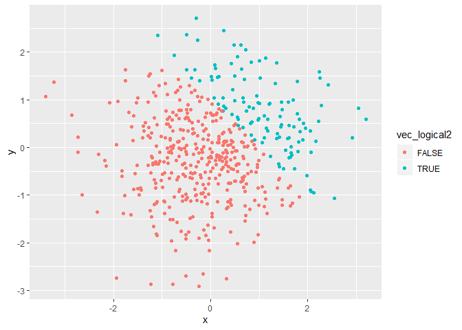
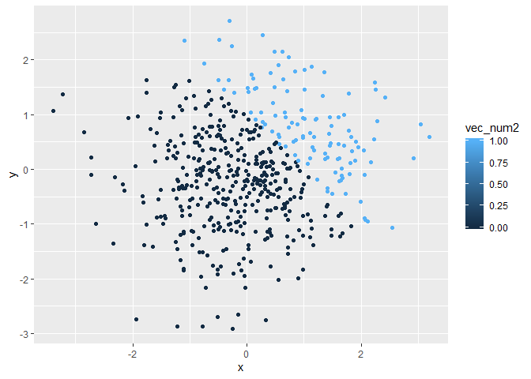
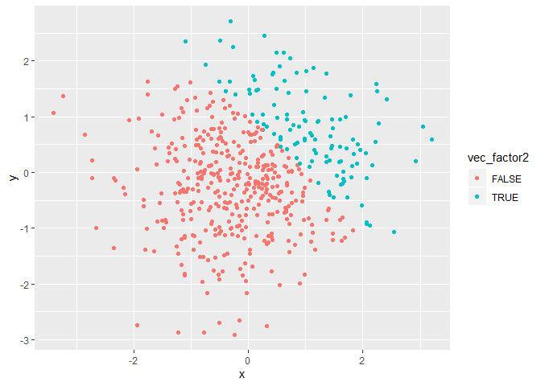

p8105\_hw1\_fw2334
================
Frances Williams
9/18/2019

# Problem 1

#### Dataframe creation and variable means

``` r
set.seed(1234)
problem1_df = tibble(
  sample1 = rnorm(8),
  vec_logical = sample1 > 0,
  vec_char = c("Ex1", "Ex2", "Ex3", "Ex4", "Ex5", "Ex6", "Ex7", "Ex8"),
  vec_factor = factor(c("Lvl1", "Lvll2", "Lvl3", "Lvl1", "Lvl2", "Lvl3", "Lvl1", "Lvl2"))
)

mean(pull(problem1_df, sample1))
```

    ## [1] -0.2971355

``` r
mean(pull(problem1_df, vec_logical))
```

    ## [1] 0.5

``` r
mean(pull(problem1_df, vec_char))
```

    ## Warning in mean.default(pull(problem1_df, vec_char)): argument is not
    ## numeric or logical: returning NA

    ## [1] NA

``` r
mean(pull(problem1_df, vec_factor))
```

    ## Warning in mean.default(pull(problem1_df, vec_factor)): argument is not
    ## numeric or logical: returning NA

    ## [1] NA

We are able to take the mean of the normal sample and the logical
vector, but not the character and factor vectors.

#### Numeric conversions

``` r
as.numeric(pull(problem1_df, vec_logical))
as.numeric(pull(problem1_df, vec_char))
as.numeric(pull(problem1_df, vec_factor))
```

The conversion of the character vector returns NAs by coercion because a
character vector cannot be converted to numeric. This explains why we
cannot take the mean of the charcter vector. We can, however, convert
the factor variable: since it is categorical, R can assign each category
a numeric value. While we were unable to take the mean of the factor
when the categories were text, now we would be able
    to.

#### Logical vector conversions

``` r
as.numeric(pull(problem1_df, vec_logical)) * pull(problem1_df, sample1)
```

    ## [1] 0.0000000 0.2774292 1.0844412 0.0000000 0.4291247 0.5060559 0.0000000
    ## [8] 0.0000000

``` r
as.factor(pull(problem1_df, vec_logical)) * pull(problem1_df, sample1)
```

    ## Warning in Ops.factor(as.factor(pull(problem1_df, vec_logical)),
    ## pull(problem1_df, : '*' not meaningful for factors

    ## [1] NA NA NA NA NA NA NA NA

``` r
as.numeric(as.factor(pull(problem1_df, vec_logical))) * pull(problem1_df, sample1)
```

    ## [1] -1.2070657  0.5548585  2.1688824 -2.3456977  0.8582494  1.0121118
    ## [7] -0.5747400 -0.5466319

Reinforcing our findings above, when we convert the logical vector to a
factor, we cannot multiply it by anything without first converting it to
numeric.

# Problem 2

#### Dataframe creation

``` r
problem2_df = tibble(
  x = rnorm(500),
  y = rnorm(500),
  vec_logical2 = (x + y) > 1,
  vec_num2 = as.numeric(vec_logical2),
  vec_factor2 = as.factor(vec_logical2)
)
```

#### Description of dataset

  - The dataset has 500 rows and 5 columns.
  - The mean of `x` is 0.0083219.
  - The median of `x` is -0.0207073.
  - The standard deviation of `x` is 1.034312.
  - The proportion of cases for when `x+y` is greater than 1 is
0.23.

#### Scatterplots

``` r
xy_scatter = ggplot(problem2_df, aes(x = x, y = y, color = vec_logical2)) + geom_point()
xy_scatter
```

<!-- -->

``` r
ggplot(problem2_df, aes(x = x, y = y, color = vec_num2)) + geom_point()
```

<!-- -->

``` r
ggplot(problem2_df, aes(x = x, y = y, color = vec_factor2)) + geom_point()
```

<!-- -->

``` r
ggsave('scatterplot.png', plot = xy_scatter)
```

    ## Saving 7 x 5 in image
