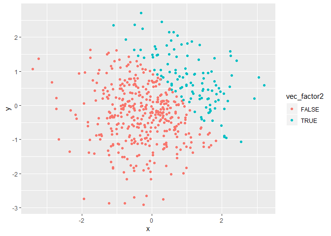

p8105\_hw1\_fw2334
================
Frances Williams
9/18/2019

# Problem 1

``` r
problem1_df = tibble(
  sample1 = rnorm(8),
  vec_logical = sample1 > 0,
  vec_char = c("Ex1", "Ex2", "Ex3", "Ex4", "Ex5", "Ex6", "Ex7", "Ex8"),
  vec_factor = factor(c("Level1", "Level2", "Level3", "Level1", "Level2", "Level3", "Level1", "Level2"))
)

mean(pull(problem1_df, sample1))
```

    ## [1] 0.4562207

``` r
mean(pull(problem1_df, vec_logical))
```

    ## [1] 0.625

``` r
mean(pull(problem1_df, vec_char))
```

    ## Warning in mean.default(pull(problem1_df, vec_char)): argument is not
    ## numeric or logical: returning NA

    ## [1] NA

``` r
mean(pull(problem1_df, vec_factor))
```

    ## Warning in mean.default(pull(problem1_df, vec_factor)): argument is not
    ## numeric or logical: returning NA

    ## [1] NA

The character and factor vectors don’t have means, and return an “NA”
message.

``` r
vec_log_num = as.numeric(problem1_df$vec_logical)
vec_char_num = as.numeric(problem1_df$vec_char)
```

    ## Warning: NAs introduced by coercion

``` r
vec_factor_num = as.numeric(problem1_df$vec_factor)
```

``` r
mutate(problem1_df,
       log_numxnorm = as.numeric(problem1_df$vec_logical) * sample1,
       log_factorxnorm = as.factor(problem1_df$vec_logical) * sample1,
       log_fact_numxnorm = as.numeric(as.factor(problem1_df$vec_logical)) * sample1
       )
```

    ## Warning in Ops.factor(as.factor(problem1_df$vec_logical), sample1): '*' not
    ## meaningful for factors

    ## # A tibble: 8 x 7
    ##   sample1 vec_logical vec_char vec_factor log_numxnorm log_factorxnorm
    ##     <dbl> <lgl>       <chr>    <fct>             <dbl> <lgl>          
    ## 1  1.52   TRUE        Ex1      Level1           1.52   NA             
    ## 2 -0.137  FALSE       Ex2      Level2           0      NA             
    ## 3  1.11   TRUE        Ex3      Level3           1.11   NA             
    ## 4 -0.192  FALSE       Ex4      Level1           0      NA             
    ## 5  0.0950 TRUE        Ex5      Level2           0.0950 NA             
    ## 6  0.438  TRUE        Ex6      Level3           0.438  NA             
    ## 7  1.09   TRUE        Ex7      Level1           1.09   NA             
    ## 8 -0.276  FALSE       Ex8      Level2           0      NA             
    ## # ... with 1 more variable: log_fact_numxnorm <dbl>

# Problem 2

``` r
set.seed(1234)
problem2_df = tibble(
  x = rnorm(500),
  y = rnorm(500),
  vec_logical2 = (x + y) > 1,
  vec_num2 = as.numeric(vec_logical2),
  vec_factor2 = as.factor(vec_logical2)
)
```

## Description of dataset

The dataset has 500 rows and 5 columns. The mean of `x` is 0.0018388.
The median of `x` is -0.0207073. The proportion of cases for when `x+y`
is greater than 1 is
0.232.

## Scatterplot

``` r
ggplot(problem2_df, aes(x = x, y = y, color = vec_logical2)) + geom_point()
```

<!-- -->

``` r
ggplot(problem2_df, aes(x = x, y = y, color = vec_num2)) + geom_point()
```

<!-- -->

``` r
ggplot(problem2_df, aes(x = x, y = y, color = vec_factor2)) + geom_point()
```

<!-- -->
